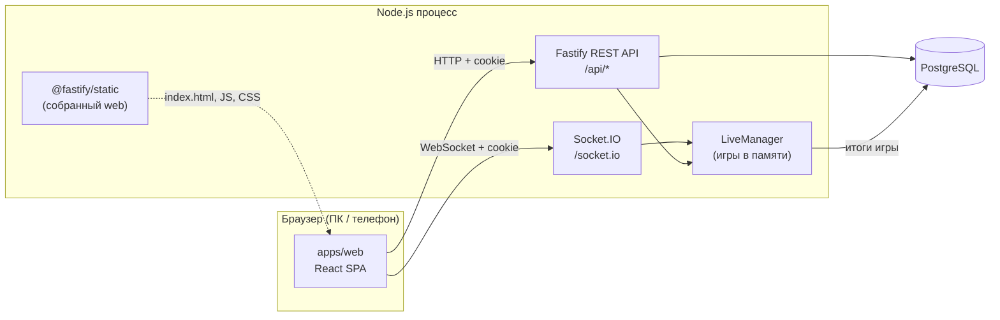
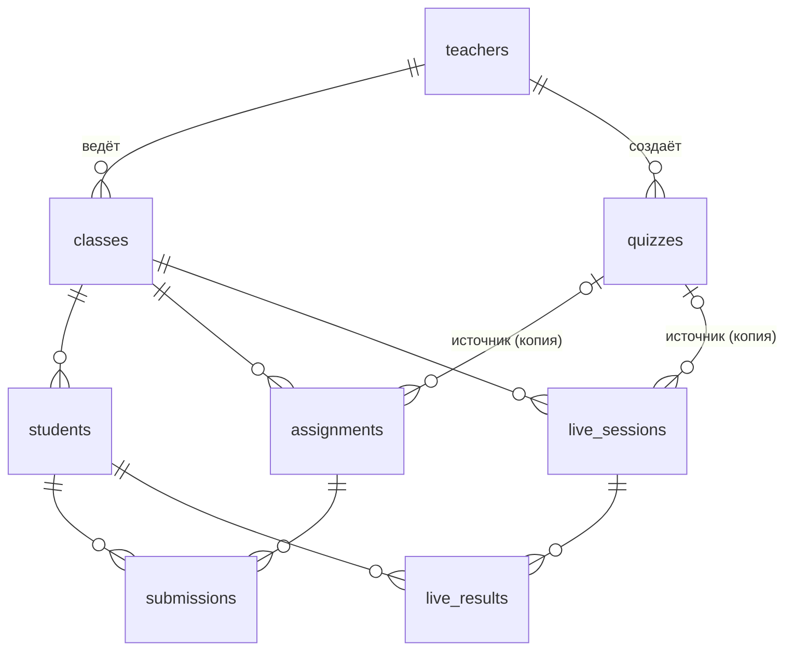
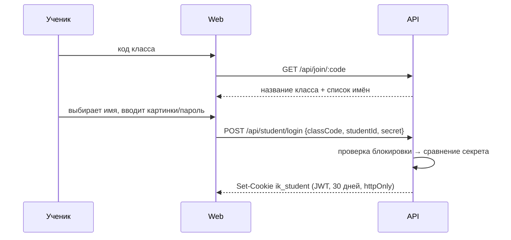
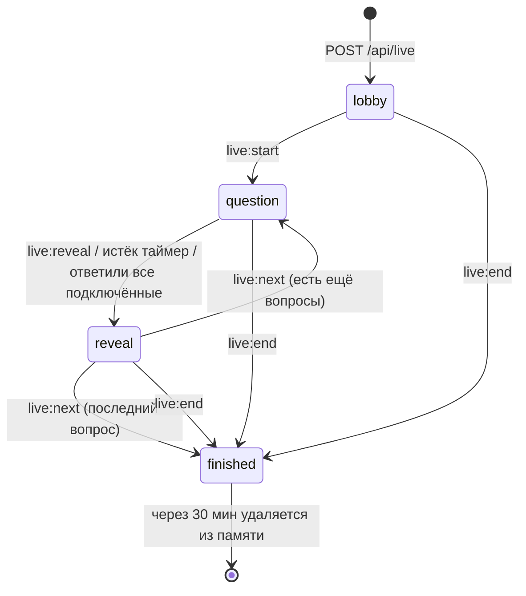

# Архитектура

Документ для разработчика: как устроен ІнфоКлас, где что лежит и почему сделано именно так.

## Общая схема



В продакшене это **один процесс**: он отдаёт интерфейс, обслуживает API и WebSocket. Такую схему проще всего развернуть бесплатно (один сервис на Render), и одного процесса хватает с большим запасом для школы.

## Монорепозиторий

npm workspaces, три пакета:

| Пакет             | Назначение                                                                                             | Зависит от                                        |
| ----------------- | ------------------------------------------------------------------------------------------------------ | ------------------------------------------------- |
| `packages/shared` | Zod-схемы вопросов и запросов, проверка ответов, типы DTO и событий Socket.IO, список картинок-паролей | `zod`                                             |
| `apps/server`     | API, авторизация, база, движок живых игр                                                               | `shared`, Fastify, Drizzle, Socket.IO             |
| `apps/web`        | интерфейс                                                                                              | `shared`, React, TanStack Query, socket.io-client |

`shared` подключается как TypeScript-исходник (`exports: ./src/index.ts`): Vite и tsx понимают TS напрямую, а сервер для продакшена собирается esbuild в один файл `dist/index.js`, и `shared` встраивается внутрь. Отдельного шага сборки для `shared` нет.

Главный принцип: **проверка ответов и валидация живут в одном месте** (`shared`). Сервер проверяет ответы теми же функциями, какими редактор тестов валидирует форму. Поэтому правила не расходятся.

## Сервер (`apps/server/src`)

```
index.ts            точка входа: конфиг → БД + миграции → Fastify → Socket.IO → listen; graceful shutdown
app.ts              buildApp(): плагины (helmet, cookie, jwt, rate-limit), обработчик ошибок, маршруты, статика
config.ts           чтение и валидация переменных окружения (Zod)
auth.ts             cookie-сессии учителя и ученика (JWT), requireTeacher / requireStudentToken
db/schema.ts        схема таблиц (Drizzle)
db/client.ts        подключение к Postgres и применение миграций
lib/access.ts       выборки «ресурс, принадлежащий этому учителю» (иначе 404)
lib/studentContext.ts  загрузка текущего ученика с проверкой, что он ещё существует в своём классе
lib/codes.ts        генерация кода класса и паролей учеников
lib/passwords.ts    scrypt-хеширование паролей учителей, сравнение за постоянное время
lib/errors.ts       HttpError и хелперы (notFound, badRequest, …)
routes/*.ts         REST-маршруты по областям
live/manager.ts     движок живых игр (состояние, таймеры, подсчёт баллов, сохранение итогов)
live/socket.ts      привязка LiveManager к Socket.IO: авторизация, комнаты, рассылка состояния
test/               интеграционные тесты (PGlite + fastify.inject + socket.io-client)
```

### Обработка ошибок

Маршруты бросают `HttpError(status, сообщение)` или `ZodError` (из `schema.parse`). Общий обработчик в `app.ts` превращает их в ответ `{ "error": "текст на украинском" }` с нужным статусом. Неожиданные ошибки логируются и возвращаются как 500 с нейтральным текстом, без деталей.

## Модель данных



| Таблица         | Ключевые поля                                                                                                                    | Примечания                                                                     |
| --------------- | -------------------------------------------------------------------------------------------------------------------------------- | ------------------------------------------------------------------------------ |
| `teachers`      | `email` (unique), `password_hash`                                                                                                | scrypt, формат `scrypt$N$r$p$salt$hash`                                        |
| `classes`       | `teacher_id`, `name`, `grade` (2–9), `join_code` (unique, 6 цифр)                                                                |                                                                                |
| `students`      | `class_id`, `display_name` (unique в классе), `secret_kind` (`pictures`/`password`), `secret`, `failed_attempts`, `locked_until` | о хранении `secret` см. раздел про безопасность                                |
| `quizzes`       | `teacher_id`, `title`, `questions` (jsonb)                                                                                       | вопросы хранятся одним JSON-массивом, формат в `shared/src/quiz.ts`            |
| `assignments`   | `class_id`, `quiz_id` (nullable), `title`, `questions` (jsonb), `due_at`, `max_attempts`, `show_correct`                         | **копия** вопросов на момент выдачи                                            |
| `submissions`   | `assignment_id`, `student_id`, `attempt`, `answers` (jsonb), `correct_count`, `total`                                            | unique (`assignment_id`, `student_id`, `attempt`) защищает от двойной отправки |
| `live_sessions` | `class_id`, `quiz_id`, `title`, `questions` (jsonb), `status` (`active`/`finished`/`aborted`)                                    |                                                                                |
| `live_results`  | `session_id`, `student_id`, `score`, `correct_count`, `total`, `answers`                                                         | пишутся одной транзакцией в конце игры                                         |

Решения:

- **Копия вопросов (snapshot)** в заданиях и играх: учитель может править или удалять тест, а старые результаты остаются корректными. При удалении теста `quiz_id` становится `NULL`.
- **Каскадное удаление:** класс → ученики, задания, игры, результаты; ученик → его ответы.
- **Вопросы в jsonb**, а не отдельными таблицами: тест всегда читается и пишется целиком, а структура вопроса проверяется Zod-схемой на входе.
- Миграции генерируются `drizzle-kit` в `apps/server/drizzle/` и применяются автоматически при старте сервера.

## Формат вопросов

Описан в `packages/shared/src/quiz.ts` (`questionSchema`):

```jsonc
// одна правильная
{ "id": "q1", "type": "single", "prompt": "…", "timeLimitSec": 30,
  "options": [{ "id": "a", "text": "…" }, …], "correctOptionId": "a" }
// несколько правильных
{ "id": "q2", "type": "multiple", …, "correctOptionIds": ["a", "c"] }
// ответ словом
{ "id": "q3", "type": "text", "prompt": "…", "timeLimitSec": 30, "acceptedAnswers": ["біт"] }
```

Ответ ученика (`AnswerValue`) — это `string` (id варианта или текст) либо `string[]` (id вариантов). Ученикам вопросы отдаются через `toPublicQuestion()`: без `correctOptionId`, `correctOptionIds` и `acceptedAnswers`.

Проверка (`isAnswerCorrect`):

- `single`: точное совпадение id;
- `multiple`: множества выбранных и правильных id совпадают;
- `text`: `normalizeText()` (NFC, нижний регистр, схлопывание пробелов, все виды апострофов → `'`) совпадает с одним из допустимых ответов.

## Авторизация и сессии



- Два независимых cookie: `ik_teacher` и `ik_student`. Учитель может открыть кабинет ученика в том же браузере, и сессии не мешают друг другу.
- JWT подписывается `JWT_SECRET`. Payload учителя: `{ role: "teacher", sub }`, ученика: `{ role: "student", sub, cls }`.
- Cookie: `httpOnly`, `SameSite=Lax`, `Secure` в продакшене, срок 30 дней.
- Каждый запрос ученика заново проверяет, что ученик существует и всё ещё в этом классе. Удалённый ученик сразу теряет доступ.
- Регистрация учителя открыта, пока в базе нет ни одного учителя, либо при `TEACHER_SIGNUP=true`.

### Защита от подбора

| Где                        | Механизм                                                                                                                                                         |
| -------------------------- | ---------------------------------------------------------------------------------------------------------------------------------------------------------------- |
| Вход учителя / регистрация | 10 запросов в минуту с IP; при неизвестном email всё равно выполняется scrypt, чтобы по времени ответа нельзя было узнать, существует ли аккаунт                 |
| Вход ученика               | после 5 ошибок подряд блокировка ученика на 60 секунд. Счётчик увеличивается атомарно (`failed_attempts + 1` в SQL), поэтому параллельные запросы его не обходят |
| Поиск класса по коду       | 60 запросов в минуту с IP                                                                                                                                        |
| Весь API                   | 1000 запросов в минуту с IP: весь класс часто выходит в интернет с одного школьного IP, поэтому общий лимит мягкий                                               |

Картинка-пароль — это 3 картинки из 12, то есть 1728 комбинаций. При 5 попытках в минуту на полный перебор ушло бы около 6 часов на одного ученика, и учитель заметил бы это раньше. Для детей 7–9 лет это разумный компромисс между безопасностью и удобством.

## Движок живых игр

`LiveManager` хранит игры в памяти процесса (`Map<sessionId, Room>`). База используется только при создании игры (строка в `live_sessions`) и в конце (итоги в `live_results`).



- **Рассылка состояния.** При любом изменении сервер отправляет каждому участнику **полный снимок** состояния для его роли (`LiveHostState` или `LivePlayerState`). Это проще и надёжнее, чем рассылать отдельные события: переподключившийся клиент сразу получает актуальную картину.
- **Роли.** Ведущий видит правильный ответ, статистику по вариантам и всех участников. Игрок видит вопрос без ответа, свой результат, а в 5–9 классах ещё топ-5 и своё место.
- **Таймер** работает на сервере. Клиент показывает обратный отсчёт по `deadline` и `serverNow`, с поправкой на расхождение часов. Ответы принимаются ещё 1,5 секунды после дедлайна (сетевая задержка).
- **Баллы:** 2–4 класс — 100 за правильный ответ; 5–9 класс — `500 + 500 × доля оставшегося времени`.
- **Итог** в журнале: `correctCount / total`, где `total` — число **заданных** вопросов (игру могли завершить досрочно). Игра, завершённая в лобби, помечается `aborted` и в журнал не попадает.
- **Одна игра на класс:** новая игра корректно завершает предыдущую.
- **Уборка:** игра без активности 3 часа завершается автоматически. При остановке сервера (SIGTERM) все незавершённые игры сохраняются. При старте сервера «висящие» `active`-сессии помечаются `aborted`.

### Socket.IO

- Путь `/socket.io`. Авторизация по тем же cookie, что и REST (разбираются из заголовка handshake).
- `allowRequest` пропускает только подключения, у которых `Origin` совпадает с `Host`: защита от подключения с чужих сайтов (CSWSH).
- Комнаты: `host:<sessionId>` и `player:<sessionId>:<studentId>`. У ученика может быть несколько вкладок: учитывается число подключений, и «онлайн» он, пока открыта хотя бы одна.

Ограничение: игры в памяти, поэтому сервер должен быть **один**. Для масштабирования на несколько экземпляров понадобится Redis-адаптер Socket.IO и вынос состояния комнат, но для школы это не нужно.

## Интерфейс (`apps/web/src`)

```
App.tsx               маршруты (createBrowserRouter), QueryClient; страницы учителя грузятся лениво
lib/api.ts            fetch-обёртка: JSON, cookie, ошибки → ApiError(status, message)
lib/session.ts        useTeacher(), useStudent(): кто вошёл (null при 401)
lib/useLive.ts        подключение к игре, авто-rejoin, отправка команд и ответов, useCountdown
lib/format.ts         украинские формы множественного числа, даты, проценты
lib/speech.ts         озвучка (Web Speech API, uk-UA)
lib/classroom.ts      ссылки для Google Classroom
components/           Layouts (шапки учителя/ученика, защита маршрутов), ui.tsx, QuestionInput
pages/public/         главная, вход по коду класса, вход учителя
pages/teacher/        классы, ученики, журнал, тесты, редактор, результаты, экран игры
pages/student/        кабинет ученика, выполнение задания, игра
styles.css            дизайн-токены (CSS-переменные) и все стили; печать карточек через @media print
```

Маршруты:

| Путь                                                | Страница                   | Доступ  |
| --------------------------------------------------- | -------------------------- | ------- |
| `/`                                                 | главная                    | все     |
| `/join`, `/join/:code?next=`                        | вход ученика               | все     |
| `/teacher/login`                                    | вход / регистрация учителя | все     |
| `/t`                                                | мои классы                 | учитель |
| `/t/classes/:id?tab=assignments\|students\|journal` | класс                      | учитель |
| `/t/classes/:id/cards`                              | карточки для печати        | учитель |
| `/t/quizzes`, `/t/quizzes/new`, `/t/quizzes/:id`    | тесты и редактор           | учитель |
| `/t/assignments/:id`                                | результаты задания         | учитель |
| `/t/live/:id`                                       | экран игры для проектора   | учитель |
| `/s`                                                | кабинет ученика            | ученик  |
| `/s/a/:id`                                          | выполнение задания         | ученик  |
| `/s/live/:id`                                       | игра                       | ученик  |

Данные загружаются через TanStack Query: кеш, повторные запросы и опрос. Кабинет ученика раз в 4 секунды проверяет, не началась ли игра, а результаты задания обновляются раз в 15 секунд.

## Безопасность и персональные данные

| Данные                                     | Где                           | Зачем                           |
| ------------------------------------------ | ----------------------------- | ------------------------------- |
| Email, имя, хеш пароля учителя             | `teachers`                    | вход учителя                    |
| Имя ученика в виде, который выбрал учитель | `students.display_name`       | ученик находит себя в списке    |
| Пароль ученика (картинки или слово)        | `students.secret`             | вход, повторная печать карточек |
| Ответы и результаты                        | `submissions`, `live_results` | журнал                          |

**Почему пароли учеников хранятся не в виде хеша.** Их придумывает не ребёнок, а сервис; это короткие одноразовые коды, которые учитель должен иметь возможность распечатать повторно. Они не могут совпасть с паролями ребёнка на других сайтах, поэтому утечка не ставит под угрозу ничего за пределами ІнфоКласа. Пароли учителей, напротив, хешируются scrypt.

Прочее:

- HTTP-заголовки безопасности через `@fastify/helmet`, строгая CSP: скрипты только со своего домена, шрифт размещён локально, внешних CDN нет.
- Все выборки учителя ограничены его `teacher_id`. Чужой ресурс отвечает 404, а не 403, поэтому нельзя даже узнать, существует ли он.
- Ученик получает задание только своего класса. Ответы на вопросы не отдаются до сдачи и не отдаются вообще при `show_correct = false`.
- CSV-экспорт экранирует значения, начинающиеся с `= + - @` (защита от формул в таблицах).
- Тело запроса ограничено 512 КБ.
- Перенаправление после входа (`?next=`) разрешено только на внутренние пути.

## Тестирование

- `packages/shared`: модульные тесты проверки ответов и схем.
- `apps/server/src/test/api.test.ts`: весь REST API через `fastify.inject` на **PGlite** (Postgres, скомпилированный в WebAssembly, работает прямо в процессе). Каждый тест получает чистую базу с настоящими миграциями.
- `apps/server/src/test/live.test.ts`: реальный сервер на случайном порту и несколько клиентов `socket.io-client`: полная игра, авто-показ ответа, досрочное завершение, права доступа, режим младших классов.

Подробнее о запуске см. [DEVELOPMENT.md](DEVELOPMENT.md).
