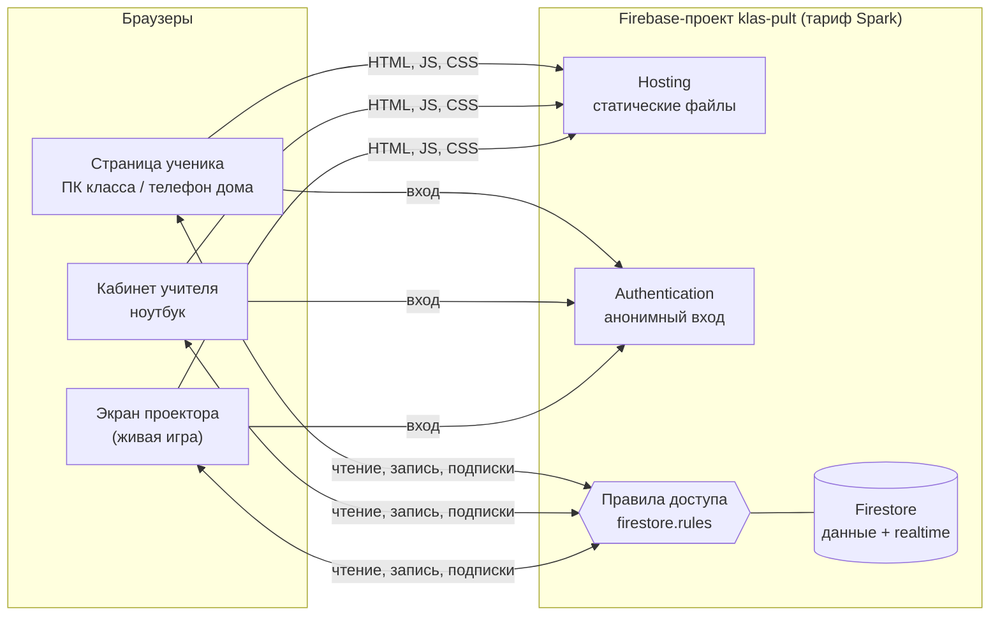
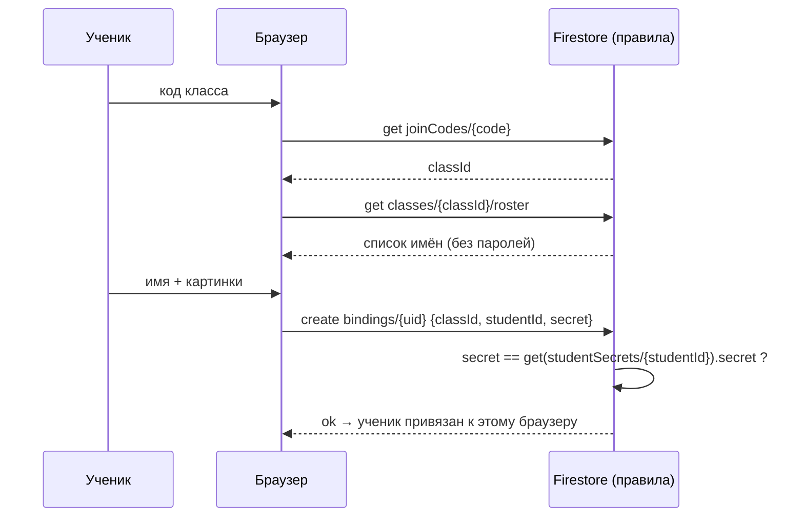
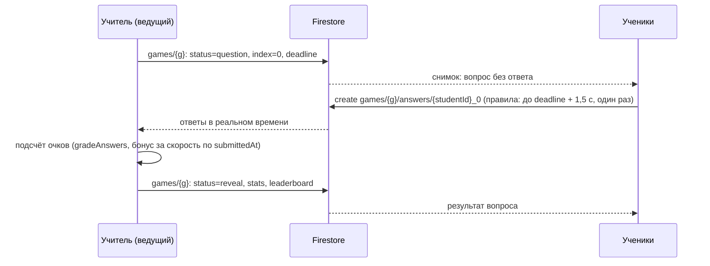

# Архитектура единой платформы

Как устроена объединённая платформа и почему. Структура данных и правила подробно описаны в [DATA_MODEL.md](DATA_MODEL.md).

## Общая схема

Своего сервера нет. Браузеры напрямую читают и пишут Firestore и получают изменения по подписке (`onSnapshot`). **Правила доступа** заменяют серверную проверку: кто что может читать и писать, срок сдачи, число попыток, защита ответов.

Кто выполняет «серверную» логику:

| Логика                                          | Где выполняется                               | Почему можно доверять                             |
| ----------------------------------------------- | --------------------------------------------- | ------------------------------------------------- |
| Права доступа, сроки, попытки, формат данных    | правила Firestore                             | выполняются на серверах Google, обойти нельзя     |
| Итоговые баллы в журнале                        | кабинет учителя (по «сырым» ответам и ключам) | ключи и расчёт видит только учитель               |
| Живая игра: переход вопросов, подсчёт очков     | браузер учителя (ведущий)                     | ученики не могут писать состояние игры            |
| Проверка ответа для мгновенного разбора ученику | браузер ученика (только отображение)          | на журнал не влияет, журнал пересчитывает учитель |

## Технологии

| Слой              | Выбор                                                                                               | Примечание                                                                                                       |
| ----------------- | --------------------------------------------------------------------------------------------------- | ---------------------------------------------------------------------------------------------------------------- |
| Интерфейс         | React 19 + TypeScript + Vite                                                                        | как в ІнфоКласе; `build.target: ['chrome109', 'firefox115']`                                                     |
| Данные на клиенте | Firebase JS SDK 11 (модульный, из npm) + свои хуки подписок                                         | вместо compat-версии с gstatic: в сборку попадает только используемое                                            |
| Общий код         | `packages/shared`                                                                                   | схемы вопросов (Zod), проверка ответов, склонения; используется интерфейсом, тестами правил и скриптами миграции |
| Хостинг           | Firebase Hosting                                                                                    | сайт `klas-pult.web.app` (адрес сохраняется)                                                                     |
| Тесты             | Vitest (модули), `@firebase/rules-unit-testing` (правила), Playwright + **Chromium 109** (сценарии) | эмуляторы Firebase, боевой проект не затрагивается                                                               |
| CI                | GitHub Actions                                                                                      | lint, typecheck, модульные тесты, правила, сценарии в Chromium 109, сборка, бюджет размера                       |

### Поддержка старых браузеров

Цель: **Chrome 109 и Firefox 115 ESR на Windows 7**.

- Vite собирает код под эти версии: новый синтаксис (`?.`, `??` и т.п.) переводится в совместимый. Глобальные API браузера новее Chrome 109 / Firefox 115 запрещает линтер (`eslint-plugin-compat`, `browserslist: chrome >= 109, firefox >= 115`). Методы объектов линтер не проверяет, их ловят сценарии в Chromium 109.
- CSS: без `:has()`, `@container` и вложенности. Автоматическая проверка (`stylelint` с `no-unsupported-browser-features`) добавляется на этапе 2.
- **Ни одного эмодзи на страницах ученика и проектора.** Иконки и картинки-пароли рисуются SVG (набор из 12 картинок, узнаваемых второклассником). Кабинет учителя эмодзи тоже не использует: учитель может открыть его на школьном ПК.
- Каждый сценарий из `e2e/` запускается в **Chromium 109** (как сейчас в Клас-пульте). Если в CI сценарий не проходит в Chromium 109, изменение не принимается.
- **Проверено на этапе 1:** React 19, React Router 8 (декларативный режим) и Firebase SDK 11 работают в Chromium 109.0.5414.0. SDK 12 не используется из-за размера (см. [ROADMAP.md](ROADMAP.md#этап-1-фундамент-)).

### Производительность на слабых ПК

| Бюджет                             | Значение                                                                    | Как соблюдается                                                                                      |
| ---------------------------------- | --------------------------------------------------------------------------- | ---------------------------------------------------------------------------------------------------- |
| JS страницы ученика (gzip)         | ≤ 200 КБ                                                                    | кабинет учителя, редактор, журнал и игра грузятся отдельными частями (`lazy`); проверка размера в CI |
| Шрифты                             | 2 файла, свои (без Google Fonts)                                            | меньше адресов для школьного фильтра трафика                                                         |
| Анимации                           | только появление карточки задания, отключается при `prefers-reduced-motion` | требование ТЗ Клас-пульта                                                                            |
| Первое отображение на Chromium 109 | ≤ 4 с                                                                       | замер в сценарии (сейчас у Клас-пульта около 3,5 с)                                                  |

## Вход

Все входят через **анонимную аутентификацию Firebase**. Роль определяется документами, которые разрешено создать только с правильным секретом.

### Вход учителя

Механизм Клас-пульта без изменений:

1. При первом открытии кабинета учитель придумывает **код учителя**. Он записывается в `secret/teacher`, который **никто не может прочитать**.
2. Чтобы браузер стал «учительским», он создаёт `teachers/{uid}` с кодом. Правила сравнивают код с `secret/teacher`.
3. `isTeacher()` в правилах означает, что существует `teachers/{request.auth.uid}`.

Поддержка нескольких учителей (из ІнфоКласа) откладывается: она не нужна сейчас и усложнила бы правила. Модель данных её не исключает: у классов и тестов есть поле `ownerId`.

### Вход ученика

- Пароль ученика (картинки или слово) лежит в `studentSecrets/{studentId}`. Прочитать его может только учитель (для печати карточек). Правила сверяют его при создании `bindings/{uid}`.
- После привязки правила определяют ученика так: `get(bindings/{request.auth.uid}).data.studentId`.
- **Ограничение:** без сервера нельзя считать неудачные попытки. Отказ правил ничего не записывает, и счётчик негде вести. Меры:
  - картинка-пароль из **4** картинок из 12 (20 736 вариантов), пароль старших — слово и 2 цифры;
  - каждая привязка сохраняет время и тип устройства, и учитель видит в карточке ученика «входил: сегодня 10:42, телефон»;
  - учитель может в один клик «вийти з усіх пристроїв» (удалить привязки ученика) и выдать новый пароль;
  - если понадобится жёстче: **Firebase App Check** (reCAPTCHA v3, бесплатно) отсекает скрипты, а на тарифе **Blaze** вход можно перенести в Cloud Function с блокировкой после 5 ошибок. Модель данных для этого менять не нужно.
- **Гостевой вход** (как в Клас-пульте): номер ПК и имя без пароля. Гость работает только внутри текущего урока. Его результаты видны в Пульте и Истории, но не в журнале.

Одна вкладка браузера не должна «выбивать» другую: анонимный вход выполняется, **только если пользователя ещё нет** (урок Клас-пульта). Учитель и ученик в одном браузере — один анонимный пользователь, у которого есть и `teachers/{uid}`, и (при желании) `bindings/{uid}`.

## Тесты, ответы и оценивание

- **Вопросы** хранятся в формате ІнфоКласа (`packages/shared/src/quiz.ts`): типы `single`, `multiple`, `text`. Тесты Клас-пульта при переносе становятся вопросами `single` (см. [MIGRATION.md](MIGRATION.md)).
- **Раздача** (задание на дом, тест на уроке, живая игра) делает **снимок** вопросов, как в обоих проектах сейчас. В снимке, который читают ученики, нет правильных ответов. Ключ лежит отдельно (`…Keys/{id}`).
- **Сдача**: ученик создаёт документ с «сырыми» ответами. Правила проверяют: ученик привязан к этому классу, срок не прошёл, номер попытки следующий и не больше разрешённого, размер ответов в пределах.
- **Журнал** считает баллы в кабинете учителя функцией `gradeAnswers()` из `shared` по ключу, а не по баллу, который мог бы прислать ученик. Для быстрого открытия журнала кабинет сохраняет **сводку** (`summary`) у задания, как Клас-пульт у сессий.
- **Мгновенный разбор для ученика** (решение на утверждение №5): правила разрешают ученику прочитать ключ задания, если у него есть сданная попытка и учитель выбрал «розбір одразу», или если срок задания закончился. Балл на экране ученика считается у него в браузере той же функцией. На журнал это не влияет.
- **Разбор на уроке** (Клас-пульт `reveals`) реализуется тем же способом: учитель нажимает «Показати учням результати», и у урокового теста включается флаг, открывающий ключ сдавшим.

## Пульт урока

Логика Клас-пульта переносится почти без изменений. Меняется только привязка к классам:

- Состояние урока — документ `rooms/{roomId}` (раньше `control/state`). Кабинет один (`roomId = "lab"`), но можно добавить второй.
- **`classId`** в состоянии урока заменяет `resetAt` + `classLabel`. «Новий клас» = выбрать класс из списка. Карточки ПК прошлого класса удаляются, как сейчас.
- Карточка ПК (`rooms/{roomId}/pcs/{pcId}`) получает `studentId` привязанного ученика. Пульт показывает имя из списка класса.
- Тест на уроке — это **уроковое задание** (`assignments` с `kind: "lesson"`), поэтому его результаты попадают в журнал. Сессия Клас-пульта (`sessions/{resetAt}_{testId}`) = уроковое задание.
- Сохраняются без изменения механизмы: ключ задания `type + sentAt`, `mergeFields`, сигнал «в сети» раз в 60 с, статус «онлайн» по расхождению часов, сверка часов через `clock/{uid}`, блокировка через `inert`, руки через `handsDown`, запрет `window.confirm/prompt/alert` (своё окно).

## Живая игра без сервера

- Ведущий — браузер учителя. Вся логика перехода вопросов из `LiveManager` ІнфоКласа переносится в модуль кабинета.
- Время ответа определяется по `request.time` / `serverTimestamp()`, а не по часам ПК. Дедлайн проверяют правила.
- Если ведущий закрыл вкладку, игра стоит на месте. После повторного открытия она продолжается с сохранённого состояния: состояние хранится в Firestore, в отличие от прежнего сервера, где оно жило в памяти.
- Итоги записываются в `gameResults` и попадают в журнал.

## Лимиты тарифа Spark

Бесплатно в сутки: **50 000 чтений, 20 000 записей, 20 000 удалений** Firestore. Хостинг: 360 МБ трафика в сутки. Анонимный вход без ограничений.

Оценка школьного дня: 6 уроков в компьютерном классе, 30 ПК, домашние задания для 150 учеников, 2 живые игры.

| Что                                                               | Записи                | Чтения                |
| ----------------------------------------------------------------- | --------------------- | --------------------- |
| Пульт: 6 уроков × (сигнал «в сети» 1 350 + задания, отметки ~500) | ~11 000               | ~18 000               |
| Домашние задания: 150 учеников × (вход, 1–2 сдачи)                | ~450                  | ~3 000                |
| Живые игры: 2 × (30 учеников × 10 вопросов + ведущий)             | ~700                  | ~3 000                |
| Журнал и история: 10 открытий по сводкам                          | ~50                   | ~2 000                |
| **Итого**                                                         | **~12 000 из 20 000** | **~26 000 из 50 000** |

Основную часть записей даёт **сигнал «в сети»**. Интервал 60 с не уменьшать. Если лимит станет тесным, первым делом увеличить интервал до 90 с. Второй вариант — тариф **Blaze** (оплата по факту): при таком объёме это несколько центов в месяц, но нужна карта.

Ежедневный замер: кабинет учителя показывает приблизительный счётчик операций за сегодня (по данным клиента) и предупреждает на 70% лимита.

## Безопасность

- Любой текст из базы выводится только как текст (React по умолчанию, без `dangerouslySetInnerHTML`).
- Ссылки для учеников — только `http`/`https` (`normalizeUrl` Клас-пульта).
- CSV экранирует `= + - @` в начале ячейки (так сделано в обоих проектах).
- Правила строго перечисляют разрешённые поля (`keys().hasOnly([...])`) и ограничивают длину строк и размер списков. Каждое правило покрыто тестом в эмуляторе (см. [ROADMAP.md](ROADMAP.md#тесты)).
- `apiKey` Firebase не секрет. Данные защищают только правила.
