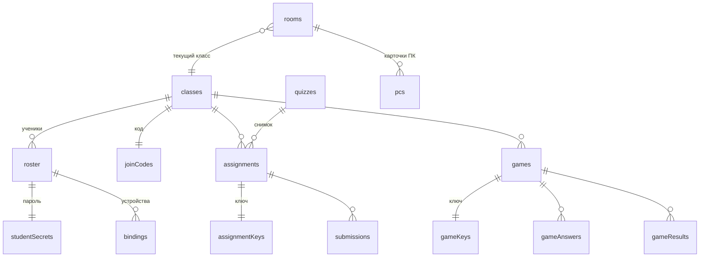

# Модель данных и правила доступа

Все коллекции Firestore единой платформы. Типы полей описываются в `packages/shared` (TypeScript + Zod), и по ним же проверяются документы в тестах правил.

Условные обозначения прав:

- **учитель** — `isTeacher()`: существует `teachers/{uid}`;
- **ученик класса C** — `isStudentOf(C)`: у пользователя есть действующая привязка к классу C (см. ниже);
- **вошедший** — любой анонимный пользователь.

## Обзор



## Учитель и служебное

Перенесено из Клас-пульта без изменений.

| Путь             | Поля                             | Пишет                               | Читает                  |
| ---------------- | -------------------------------- | ----------------------------------- | ----------------------- |
| `setup/state`    | `codeSet: true`                  | один раз, вместе с `secret/teacher` | вошедший                |
| `secret/teacher` | `code` (4–64 символа)            | один раз при первом запуске         | никто (сверяют правила) |
| `teachers/{uid}` | `code` (= `secret/teacher.code`) | сам `uid`, только с верным кодом    | сам `uid`               |
| `clock/{uid}`    | `t` (= `request.time`)           | сам `uid`                           | сам `uid`               |

## Классы и ученики

| Путь                                   | Поля                                                                              | Пишет                              | Читает                                      |
| -------------------------------------- | --------------------------------------------------------------------------------- | ---------------------------------- | ------------------------------------------- |
| `classes/{classId}`                    | `name` (≤ 40), `grade` (2–9), `joinCode`, `ownerId`, `createdAt`, `archived`      | учитель                            | учитель; ученик этого класса (`get`)        |
| `joinCodes/{code}`                     | `classId`                                                                         | учитель                            | вошедший, только `get` (не список)          |
| `classes/{classId}/roster/{studentId}` | `displayName` (≤ 60), `secretKind` (`pictures`/`password`), `createdAt`           | учитель                            | вошедший (список имён для выбора при входе) |
| `studentSecrets/{studentId}`           | `classId`, `secret`                                                               | учитель                            | учитель (печать карточек)                   |
| `bindings/{uid}`                       | `classId`, `studentId`, `secret`, `createdAt` (= `request.time`), `device` (≤ 40) | сам `uid`, только с верным паролем | сам `uid`; учитель                          |

**Привязка устройства.** Ученик создаёт `bindings/{uid}`. Правило:

```js
match /bindings/{uid} {
  allow create: if signedIn() && request.auth.uid == uid
    && request.resource.data.keys().hasOnly(['classId', 'studentId', 'secret', 'createdAt', 'device'])
    && request.resource.data.createdAt == request.time
    && request.resource.data.secret
         == get(/databases/$(database)/documents/studentSecrets/$(request.resource.data.studentId)).data.secret
    && request.resource.data.classId
         == get(/databases/$(database)/documents/studentSecrets/$(request.resource.data.studentId)).data.classId;
  allow get: if signedIn() && (request.auth.uid == uid || isTeacher());
  allow list: if isTeacher();
  allow delete: if signedIn() && (request.auth.uid == uid || isTeacher());
}
```

**Проверка «ученик класса».** Привязка действительна, пока совпадает с текущим паролем. Поэтому «Новий пароль» у учителя сразу отключает все старые устройства ученика:

```js
function binding() {
  return get(/databases/$(database)/documents/bindings/$(request.auth.uid)).data;
}
function isStudentOf(classId) {
  return signedIn()
    && exists(/databases/$(database)/documents/bindings/$(request.auth.uid))
    && binding().classId == classId
    && binding().secret
       == get(/databases/$(database)/documents/studentSecrets/$(binding().studentId)).data.secret;
}
function myStudentId() { return binding().studentId; }
```

Одно такое правило тратит 2–3 обращения `get/exists` из 10 разрешённых на запрос.

## Банк тестов

| Путь               | Поля                                                                                                                    | Пишет   | Читает  |
| ------------------ | ----------------------------------------------------------------------------------------------------------------------- | ------- | ------- |
| `quizzes/{quizId}` | `title` (≤ 200), `folder` (≤ 60), `questions` (формат `Question` с ответами, ≤ 50), `ownerId`, `createdAt`, `updatedAt` | учитель | учитель |

Ученики банк не читают никогда: они получают снимок без ответов в задании или игре. Поэтому ответы хранятся прямо в тесте, отдельный `keys` для банка не нужен (в Клас-пульте `tests` читали ученики, поэтому там ключ был отдельно).

## Задания: домашние и уроковые

Домашнее задание ІнфоКласа и тест на уроке Клас-пульта — **одна сущность**, отличается `kind`.

| Путь                                      | Поля                                                                                                                                                                                                                                                                                                                                                               | Пишет                                                          | Читает                                    |
| ----------------------------------------- | ------------------------------------------------------------------------------------------------------------------------------------------------------------------------------------------------------------------------------------------------------------------------------------------------------------------------------------------------------------------ | -------------------------------------------------------------- | ----------------------------------------- |
| `assignments/{aId}`                       | `classId`, `kind` (`homework`/`lesson`), `quizId`, `title`, `questions` (снимок **без ответов**, `PublicQuestion[]`), `dueAt` (Timestamp или `null`), `maxAttempts` (1–20 или `null`), `reveal` (`immediate`/`after_due`/`never`), `revealNow` (bool, «Показати учням результати» на уроке), `roomId`, `createdAt`, `summary` `{submitted, avgPercent, updatedAt}` | учитель                                                        | учитель; ученик класса `classId`          |
| `assignmentKeys/{aId}`                    | `questions` (снимок **с ответами**)                                                                                                                                                                                                                                                                                                                                | учитель                                                        | учитель; ученик по условию разбора (ниже) |
| `submissions/{aId}_{studentId}_{attempt}` | `assignmentId`, `classId`, `studentId`, `attempt`, `answers` (карта `questionId → string                                                                                                                                                                                                                                                                           | string[]`), `submittedAt`(=`request.time`), `pcId` (для урока) | ученик (только создание)                  | учитель; сам ученик |
| `guestResults/{autoId}`                   | `assignmentId`, `pcId`, `name`, `answers`, `submittedAt`                                                                                                                                                                                                                                                                                                           | гость на уроке (только создание)                               | учитель                                   |

**Правило сдачи** (главное, что раньше проверял сервер ІнфоКласа):

```js
match /submissions/{subId} {
  function a() { return get(/databases/$(database)/documents/assignments/$(request.resource.data.assignmentId)).data; }
  function prevId() {
    return request.resource.data.assignmentId + '_' + request.resource.data.studentId + '_'
      + string(request.resource.data.attempt - 1);
  }
  allow create: if isStudentOf(request.resource.data.classId)
    && request.resource.data.studentId == myStudentId()
    && a().classId == request.resource.data.classId
    && subId == request.resource.data.assignmentId + '_' + myStudentId() + '_' + string(request.resource.data.attempt)
    && (request.resource.data.attempt == 1
        || exists(/databases/$(database)/documents/submissions/$(prevId())))
    && (a().maxAttempts == null || request.resource.data.attempt <= a().maxAttempts)
    && (a().dueAt == null || request.time <= a().dueAt)
    && request.resource.data.submittedAt == request.time
    && request.resource.data.answers is map && request.resource.data.answers.size() <= 50;
  allow get, list: if isTeacher()
    || (signedIn() && resource.data.studentId == myStudentId());
  allow delete: if isTeacher();
}
```

Детерминированный id (`{задание}_{ученик}_{попытка}`) сам не даёт сдать одну попытку дважды: второе создание — это изменение, а изменение запрещено.

**Правило разбора** (когда ученику можно прочитать ключ):

```js
match /assignmentKeys/{aId} {
  function a() { return get(/databases/$(database)/documents/assignments/$(aId)).data; }
  function submitted() {
    return exists(/databases/$(database)/documents/submissions/$(aId + '_' + myStudentId() + '_1'));
  }
  allow read: if isTeacher()
    || (isStudentOf(a().classId) && (
         (a().reveal == 'immediate' && submitted())
      || (a().revealNow == true && submitted())
      || (a().reveal == 'after_due' && a().dueAt != null && request.time > a().dueAt)));
  allow write: if isTeacher();
}
```

## Пульт урока

Из Клас-пульта (`control/state` и `students/{pcId}`) с привязкой к классам.

| Путь                        | Поля                                                                                                                                                                                                                                                                                                 | Пишет                                                                                          | Читает   |
| --------------------------- | ---------------------------------------------------------------------------------------------------------------------------------------------------------------------------------------------------------------------------------------------------------------------------------------------------- | ---------------------------------------------------------------------------------------------- | -------- |
| `rooms/{roomId}`            | `classId`, `task` (`{type, sentAt, target, url?, title?, text?, assignmentId?, count?}` или `null`), `lastTest` (`{assignmentId, title, sentAt, target}`), `locked`, `theme` (`junior`/`senior`), `timer` (`{id, durationMs, startedAt}` или `null`), `handsDown` (карта `pcId → handId`), `resetAt` | учитель                                                                                        | вошедший |
| `rooms/{roomId}/pcs/{pcId}` | `pc`, `num`, `name`, `studentId` (или `null` у гостя), `lastSeen`, `openedAt`, `submittedAt`, `handAt`, `handId`, `doneAt`                                                                                                                                                                           | вошедший (id `pc01…pc99`, только перечисленные поля; `studentId` должен совпадать с привязкой) | учитель  |

Отличия от Клас-пульта:

- `resetAt` + `classLabel` заменены на `classId`. `resetAt` остаётся только как сигнал «Новий клас» для ПК: при смене значения ученик возвращается ко входу, номер ПК сохраняется.
- Тест на уроке — это `assignments` с `kind: "lesson"`, и `task.assignmentId` указывает на него. Сдача идёт в `submissions` (или `guestResults` у гостя), а не в `results`.
- `reveals/{sessionId}` не нужен: разбор открывает флаг `revealNow` у задания через правило `assignmentKeys`.

## Живые игры

| Путь                                         | Поля                                                                                                                                                                                                                                                                                                 | Пишет                                                                        | Читает                 |
| -------------------------------------------- | ---------------------------------------------------------------------------------------------------------------------------------------------------------------------------------------------------------------------------------------------------------------------------------------------------- | ---------------------------------------------------------------------------- | ---------------------- |
| `games/{gameId}`                             | `classId`, `title`, `questions` (без ответов), `status` (`lobby`/`question`/`reveal`/`finished`), `index`, `startedAt`, `deadline`, `junior`, `stats` (распределение ответов при `reveal`), `leaderboard` (топ-5, только 5–9 класс), `participants` (карта `studentId → {name, score}`), `createdAt` | учитель (ведущий)                                                            | учитель; ученик класса |
| `gameKeys/{gameId}`                          | `questions` с ответами                                                                                                                                                                                                                                                                               | учитель                                                                      | учитель                |
| `games/{gameId}/answers/{studentId}_{index}` | `studentId`, `index`, `value`, `at` (= `request.time`)                                                                                                                                                                                                                                               | ученик класса, один раз, только для текущего вопроса и до `deadline + 1,5 с` | учитель; сам ученик    |
| `gameResults/{gameId}_{studentId}`           | `gameId`, `classId`, `studentId`, `score`, `correctCount`, `total`                                                                                                                                                                                                                                   | учитель в конце игры                                                         | учитель; сам ученик    |

## Индексы

`firestore.indexes.json`:

| Коллекция     | Поля                              | Для чего                           |
| ------------- | --------------------------------- | ---------------------------------- |
| `assignments` | `classId ↑`, `createdAt ↓`        | задания класса (кабинет и ученик)  |
| `assignments` | `quizId ↑`, `createdAt ↓`         | «давали: 5-А 25.09» в банке тестов |
| `submissions` | `assignmentId ↑`, `submittedAt ↓` | результаты задания                 |
| `submissions` | `classId ↑`, `studentId ↑`        | журнал ученика                     |
| `gameResults` | `classId ↑`, `gameId ↑`           | журнал                             |

## Тесты правил

Каждое правило из этого документа покрывается тестом в `firestore/rules.test.ts` на эмуляторе. Минимальный набор для приёмки:

- ученик не читает `quizzes`, `studentSecrets`, чужие `bindings`, `submissions` других учеников, `gameKeys`;
- ученик не читает `assignmentKeys`, пока не сдал задание (при `immediate`) или не наступил срок (при `after_due`);
- нельзя создать привязку с неверным паролем и нельзя привязаться к чужому `uid`;
- после смены пароля старая привязка не даёт сдать задание;
- нельзя сдать после срока, сверх попыток, чужим `studentId`, повторить ту же попытку, пропустить номер попытки;
- нельзя ответить в игре после дедлайна, на не текущий вопрос, дважды;
- ученик не пишет `rooms/{roomId}`, `assignments`, `games`;
- все проверки Клас-пульта из `tests/rules.test.js` (19 групп) переносятся и продолжают проходить.
